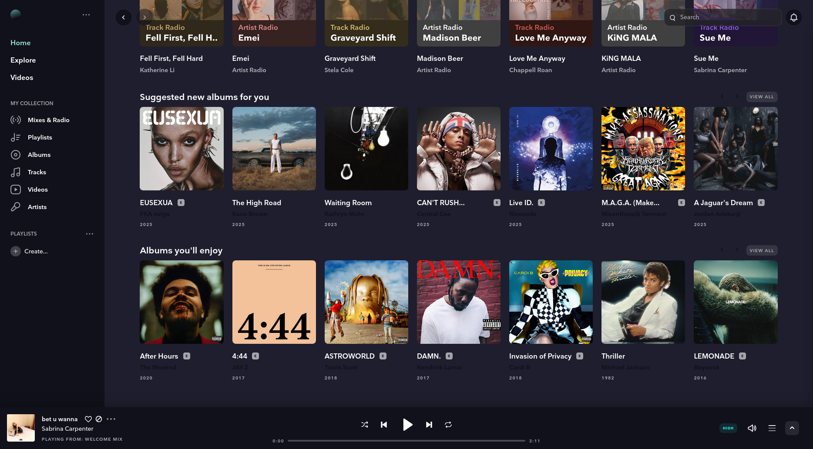

<h3 align="center">
	 
	
	Catppuccin for <a href="https://github.com/Mastermindzh/tidal-hifi">Tidal Hi-Fi</a>
	
</h3>

	

## Usage

1. Download the theme
      - **Latte is not avaliable at this time! ⚠️**
      - [Frappe](https://raw.githubusercontent.com/pernydev/tidal-catppuccin/refs/heads/main/frappe.css)
      - [Macchiato](https://github.com/pernydev/tidal-catppuccin/raw/refs/heads/main/macchiato.css)
      - [Mocha](https://raw.githubusercontent.com/pernydev/tidal-catppuccin/refs/heads/main/mocha.css)
2. Open Tidal Hi-Fi
3. Open the settings
5. Click on "Theming" and "Choose files" under "Upload new themes"
6. Select the theme from the dropdown under "Choose theme"
7. Restart Tidal Hi-Fi

	

	

